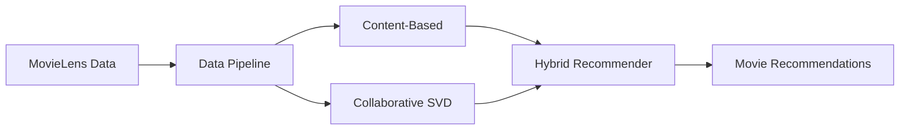
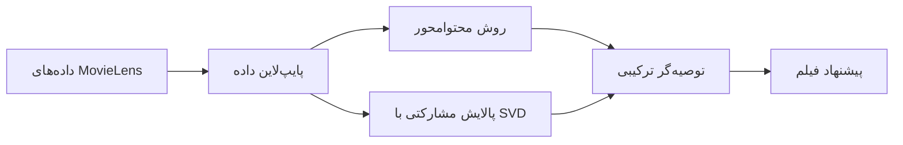

[🇺🇸 English](#-english-readme) | [🇮🇷 فارسی](#-راهنمای-فارسی)
)

# English

# Hybrid Movie Recommendation System

[](LICENSE)


A modular machine-learning project that explores three complementary movie-recommendation approaches on MovieLens data: Content-Based Filtering, Collaborative Filtering, and a Hybrid recommendation flow.

## What it includes

- **Data pipeline** — loads movie and rating data, validates basic data quality, and prepares movie metadata.
- **Content-Based Filtering** — turns genres into a one-hot feature matrix and finds similar movies with cosine similarity.
- **Collaborative Filtering** — trains a Surprise SVD model on user ratings, evaluates it with RMSE and MAE, and returns personalized Top-N movies.
- **Hybrid Recommender** — runs both models for a known user and seed movie, removes previously rated movies, and separates results into shared, Content-Based-only, and Collaborative-only sections.



## Project layout

```text
src/       Core recommendation modules
scripts/   Runnable data, model, and recommendation workflows
docs/      Focused module documentation
outputs/   Generated artifacts and a versioned showcase
data/      Raw MovieLens CSV files managed with Git LFS
```

## Quick start

```bash
git lfs install
git clone https://github.com/Hosein-imani/hybrid-recommendation-system.git
cd hybrid-recommendation-system
python -m pip install -r requirements.txt scikit-surprise joblib
```

Run the main workflows from the repository root:

```bash
python -m scripts.dataset.analyze_dataset
python -m scripts.content_based.run_recommender
python -m scripts.collaborative.run_svd
python -m scripts.hybrid.run_hybrid
```

> **Dependency note:** the Collaborative Filtering code imports `scikit-surprise` and `joblib`. They are included in the command above because the current dependency manifest does not yet list them.

## Results and showcase

The repository keeps lightweight reports, sample recommendations, and visualizations in `outputs/showcase/` for the Dataset, Content-Based, and Collaborative workflows. Large trained-model binaries and generated run outputs remain local to keep the repository lightweight.

The versioned Collaborative showcase reports **RMSE 0.8200** and **MAE 0.6246** on a test split of 780,000 ratings. Generated Hybrid outputs are written locally under `outputs/hybrid/` and can be promoted to the showcase when ready.

## Documentation
## 📗 راهنمای فارسی

- [Data pipeline](docs/dataset.md)
- [Content-Based Filtering](docs/content_based.md)
- [Collaborative Filtering](docs/collaborative.md)
- [Hybrid Recommender](docs/hybrid.md)

## Roadmap

- Dockerized development and deployment
- API layer for serving recommendations
- Ranking metrics such as Precision@K, Recall@K, and NDCG
- Richer movie features and additional recommendation algorithms

## License

Released under the [MIT License](LICENSE).

---

# راهنمای فارسی

# سامانهٔ پیشنهاددهندهٔ ترکیبی فیلم

[](LICENSE)


این پروژهٔ ماژولارِ یادگیری ماشین، سه روش مکمل را برای پیشنهاد فیلم با داده‌های MovieLens پیاده‌سازی می‌کند: روش محتوامحور (`Content-Based Filtering`)، پالایش مشارکتی (`Collaborative Filtering`) و روش ترکیبی (`Hybrid`).

## اجزای اصلی

- **پایپ‌لاین داده** — داده‌های فیلم و امتیاز را بارگذاری می‌کند، کیفیت پایهٔ آن‌ها را بررسی می‌کند و اطلاعات فیلم‌ها را آماده می‌سازد.
- **روش محتوامحور** — ژانرها را به یک ماتریس ویژگیِ صفر و یک تبدیل می‌کند و با شباهت کسینوسی، فیلم‌های مشابه را پیدا می‌کند.
- **پالایش مشارکتی** — با امتیازهای کاربران، مدل `SVD` کتابخانهٔ `Surprise` را آموزش می‌دهد، آن را با `RMSE` و `MAE` ارزیابی می‌کند و پیشنهادهای شخصی‌سازی‌شده می‌سازد.
- **توصیه‌گر ترکیبی** — هر دو روش را برای یک کاربر و فیلم مبنا اجرا می‌کند، فیلم‌های قبلاً امتیازدهی‌شده را کنار می‌گذارد و پیشنهادها را در سه گروه مشترک، محتوامحور و مشارکتی نمایش می‌دهد.



## ساختار پروژه

```text
src/       ماژول‌های اصلی سامانهٔ پیشنهاددهنده
scripts/   مسیرهای اجرای داده، مدل و پیشنهادها
docs/      مستندات خلاصهٔ هر بخش
outputs/   خروجی‌ها و نمونه‌خروجی‌های نسخه‌بندی‌شده
data/      فایل‌های خام MovieLens، مدیریت‌شده با Git LFS
```

## اجرای سریع

برای دریافت فایل‌های داده از Git LFS استفاده می‌شود:

```bash
git lfs install
git clone https://github.com/Hosein-imani/hybrid-recommendation-system.git
cd hybrid-recommendation-system
python -m pip install -r requirements.txt scikit-surprise joblib
```

دستورهای اصلی را از پوشهٔ اصلی پروژه اجرا کنید:

```bash
python -m scripts.dataset.analyze_dataset
python -m scripts.content_based.run_recommender
python -m scripts.collaborative.run_svd
python -m scripts.hybrid.run_hybrid
```

> **نکتهٔ وابستگی‌ها:** بخش پالایش مشارکتی از `scikit-surprise` و `joblib` استفاده می‌کند، اما این دو هنوز در فایل وابستگی‌های فعلی ثبت نشده‌اند؛ به همین دلیل در دستور نصب بالا به‌صورت صریح آمده‌اند.

## نتایج و نمونه‌خروجی‌ها

گزارش‌های سبک، نمونه‌پیشنهادها و نمودارهای مربوط به داده‌ها، روش محتوامحور و پالایش مشارکتی در `outputs/showcase/` نگهداری می‌شوند. مدل‌های بزرگ و خروجی‌های اجرای جدید به‌صورت محلی باقی می‌مانند تا مخزن سبک بماند.

نتیجهٔ ثبت‌شدهٔ پالایش مشارکتی در نمونه‌خروجی‌ها برابر با **RMSE 0.8200** و **MAE 0.6246** روی 780,000 امتیاز آزمایشی است. خروجی روش ترکیبی به‌صورت محلی در `outputs/hybrid/` ساخته می‌شود و در زمان مناسب می‌تواند به بخش نمونه‌خروجی‌ها افزوده شود.

## مستندات

- [پایپ‌لاین داده](docs/dataset.md)
- [روش محتوامحور](docs/content_based.md)
- [پالایش مشارکتی](docs/collaborative.md)
- [توصیه‌گر ترکیبی](docs/hybrid.md)

## مسیر توسعه

- `Docker` برای اجرای پروژه و استقرار آن
- `API` برای ارائهٔ پیشنهادها
- `Precision@K`، `Recall@K` و `NDCG` برای سنجش کیفیت رتبه‌بندی
- استفاده از ویژگی‌های غنی‌تر و مدل‌های پیشنهاددهندهٔ بیشتر

## مجوز

این پروژه تحت [مجوز MIT](LICENSE) منتشر شده است.
